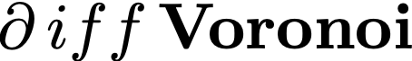
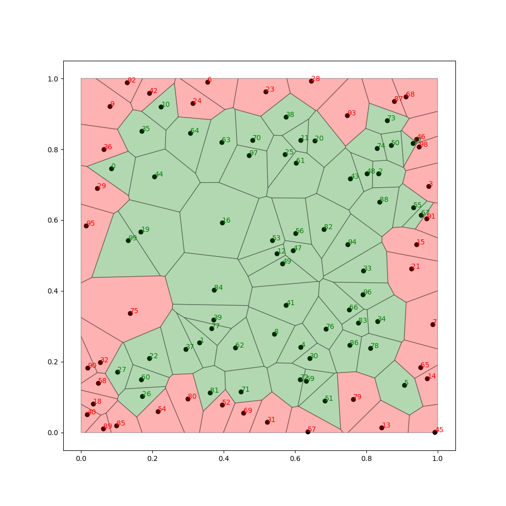
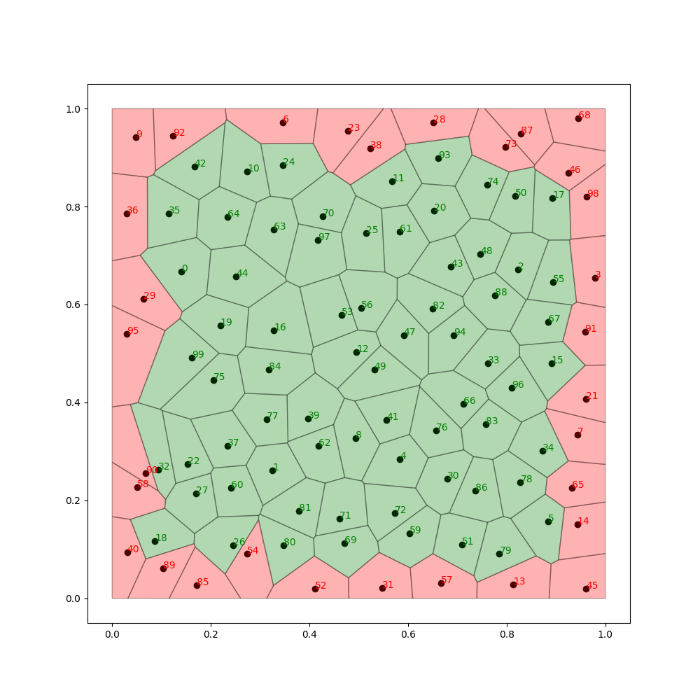
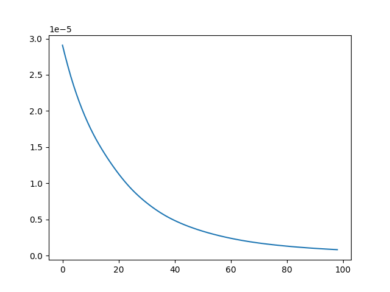

## Differentiable Voronoi Tessellation

End-to-end differentiation of geometrical construction of the Voronoi tessellation for various applications.


Install:
```
pip install differentiable_voronoi
from differentiable_voronoi import differentiable_voronoi
```

**Step-by-step usage:**

Consider we are given a 2D point cloud and a boundary. We assume all points are inside the boundary.
We build the Voronoi tessellation on this set.
```
import matplotlib.pyplot as plt
from differentiable_voronoi import differentiable_voronoi, triangulate
import torch
from tqdm import tqdm
import numpy as np
from copy import deepcopy

l = 1
eps = 0.0001
coords = np.random.rand(100, 2)
boundary = torch.tensor([[-eps, -eps],
                         [-eps, l + eps],
                         [l + eps, l + eps],
                         [l + eps, -eps]], requires_grad=False)
                         
differentiable_voronoi(torch.tensor(coords, dtype=torch.float),
                       triangulate(coords),
                       vizualize=True,
                       boundary=boundary)
```


We want to minimize the variance of the Voronoi regions' areas. 
To do this, we construct a standard PyTorch training loop:


```
def train(point_cloud, boundary, clamp_min=0, clamp_max=1., n_epochs=100):
    coords = torch.tensor(point_cloud, requires_grad=True)
    optimizer = torch.optim.Adam([coords], lr=0.001)
    mesh = triangulate(coords.clone().detach().numpy())
    loss_curve = []

    for i in tqdm(range(1, n_epochs)):
        optimizer.zero_grad()
        edge_index, areas, e, clipped_vertices_dict = differentiable_voronoi(coords, mesh, boundary, vizualize=False)

        loss = torch.mean((areas - torch.mean(areas)) ** 2)
        loss_curve.append(loss.item())
        loss.backward()
        optimizer.step()

        with torch.no_grad():
            coords[:] = coords.clamp(clamp_min, clamp_max)
            mesh = triangulate(coords.clone().detach().numpy())

    return coords, loss_curve
    
optimized_coords, loss_curve = train(deepcopy(coords), boundary)

differentiable_voronoi(optimized_coords.detach(),
                       triangulate(optimized_coords.detach().numpy()),
                       vizualize=True,
                       boundary=boundary)
```
After training, we plot the loss curve and vizualize the optimized point location.




If you find this code useful, please, consider citing

```
@misc{shumilin2023method,
      title={A Method for Auto-Differentiation of the Voronoi Tessellation}, 
      author={Sergei Shumilin and Alexander Ryabov and Serguei Barannikov and Evgeny Burnaev and Vladimir Vanovskii},
      year={2023},
      eprint={2312.16192},
      archivePrefix={arXiv},
      primaryClass={cs.CG}
}
```
